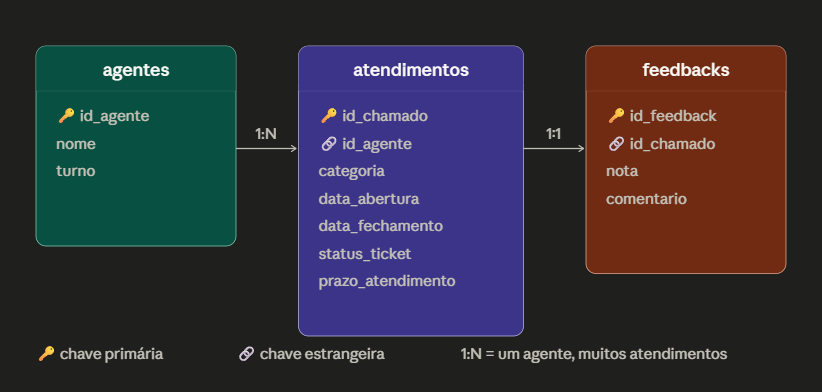

# suporte_whatsapp_analysis
Análise de dados de suporte ao cliente via WhatsApp

> ⚠️ **Projeto em construção** — a próxima etapa prevê integração real com a API do WhatsApp Business para substituir os dados simulados por dados reais da operação.

## Sobre o Projeto

Este projeto analisa a performance da área de suporte ao cliente e a satisfação dos clientes de uma empresa de pequeno porte cujo atendimento é realizado via WhatsApp. A motivação é identificar gargalos operacionais e causas de churn para apoiar decisões estratégicas da gestão.

Para isso, foram utilizados dados simulados com Python, queries SQL para responder perguntas de negócio e Power BI para visualização dos indicadores (em construção).

## Estrutura do Repositório
suporte_whatsapp_analysis/
├── dados/
│   ├── agentes.csv
│   ├── atendimentos.csv
│   └── feedbacks.csv
├── imagens/
│   └── modelo_relacional.png
├── perguntas_de_negocio/
│   ├── 01_taxa_resolucao.sql
│   ├── 02_volume_por_categoria.sql
│   ├── 03_tempo_medio_atendimento.sql
│   ├── 04_desempenho_por_agente.sql
│   ├── 05_satisfacao_por_categoria.sql
│   └── 06_tendencia_mensal.sql
├── conexao_sql.ipynb
└── README.md

## Modelo de Dados

## Ferramentas

| Ferramenta | Uso |
|---|---|
| Python (pandas, numpy, random) | Geração e tratamento dos dados simulados |
| SQL (SQLite) | Perguntas de negócio |
| Power BI | Dashboard interativo (em construção) |

## Perguntas de Negócio

### 1. Qual é a taxa de resolução geral do suporte?
64,4% dos atendimentos são resolvidos, 20,9% não são resolvidos e 14,7% permanecem abertos. O volume de tickets não resolvidos representa um risco direto de churn.

### 2. Qual categoria de problema tem maior volume?
O volume está distribuído de forma equilibrada entre as categorias (~16% cada), reflexo da simulação com probabilidades iguais. Em dados reais, espera-se concentração em 2 ou 3 categorias dominantes.

### 3. Qual o tempo médio de atendimento por categoria?
O tempo médio ficou entre 22 e 24 horas para todas as categorias, sem variação significativa. Limitação da simulação — em produção real, categorias como bug e reclamação tendem a ter tempos maiores.

### 4. Qual agente tem melhor desempenho?
Vitor lidera a taxa de resolução com 66,9% e Ana tem o menor índice com 61,2%. A nota média de satisfação varia entre 2,9 e 3,0 — próxima da neutralidade para todos os agentes.

### 5. Qual categoria tem pior satisfação?
Bug apresenta a menor nota média (2,7) e lentidão a maior (3,1). Categorias mais complexas tendem a gerar maior frustração no cliente, confirmando parcialmente a hipótese 3 do projeto.

### 6. Como o volume evolui mês a mês?
Março teve o menor volume (229 tickets) e maio o maior (267). A variação sugere sazonalidade — em dados reais seria possível cruzar com eventos do produto ou campanhas para explicar os picos.

## Limitações

- **Dados simulados:** os datasets foram gerados com probabilidades uniformes entre categorias e agentes, resultando em distribuições mais homogêneas do que se observaria em dados reais
- **Métricas não calculadas:** FCR, FRT e NPS foram excluídos por limitação do modelo de dados simulado
- **Integração pendente:** a versão de produção prevê conexão com a API do WhatsApp Business para ingestão de dados reais

## Como Reproduzir

1. Clone o repositório
2. Abra o `conexao_sql.ipynb` no Google Colab
3. Execute todas as células em ordem — Runtime → Run all

## Autora

[Ingrid Sena] — [[LinkedIn](https://www.linkedin.com/in/ingrid-sena-andrade/)](#)
